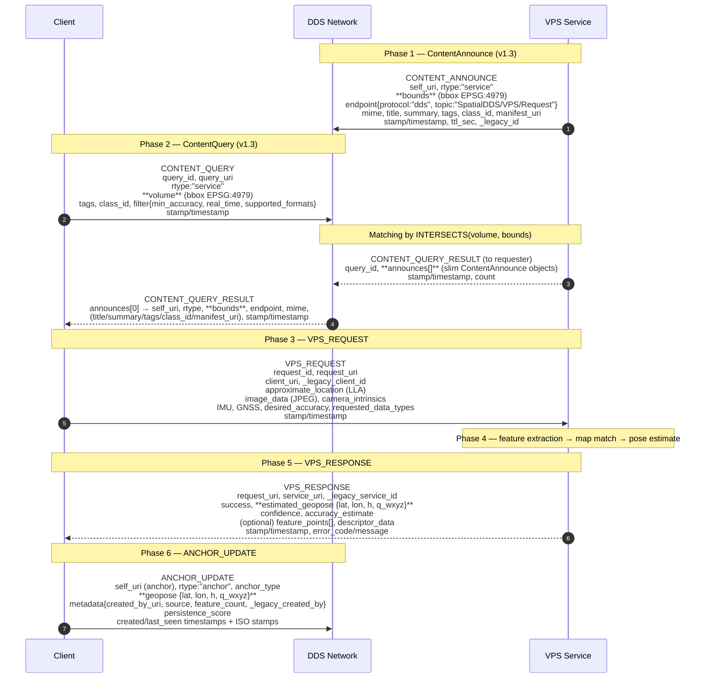
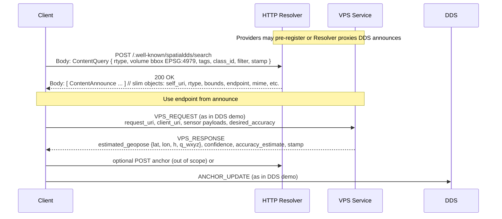

# SpatialDDS v1.3 Demo Implementation

A complete reference implementation of the SpatialDDS v1.3 specification using Eclipse Cyclone DDS, demonstrating VPS (Visual Positioning Service) discovery, localization, and anchor management.

## Overview

This project provides:
- **Complete SpatialDDS v1.3 protocol implementation**
- VPS mock service with GeoPose-based localization
- HTTP REST API binding for content discovery
- Comprehensive validation utilities
- Full message logging and visualization
- Docker containerization for easy deployment

## Protocol Flow

### DDS-based Communication



### HTTP-based Communication



## Quick Start

### Build and Run

```bash
# Build the Docker image
docker build -t cyclonedds-python .

# Run the SpatialDDS v1.3 demo
docker run --rm --network host cyclonedds-python
```

### Run SpatialDDS Tests

```bash
# Default: Show full message content
docker run --rm --network host cyclonedds-python python3 spatialdds_test.py

# Summary only (no message content)
docker run --rm --network host cyclonedds-python python3 spatialdds_test.py --summary-only

# Detailed mode (includes full sensor data)
docker run --rm --network host cyclonedds-python python3 spatialdds_test.py --detailed
```

### HTTP Binding Server

```bash
# Start HTTP REST API server
docker run --rm -p 8080:8080 cyclonedds-python python3 http_binding.py

# Test the endpoints
curl http://localhost:8080/

# Search for content
curl -X POST http://localhost:8080/.well-known/spatialdds/search \
  -H "Content-Type: application/json" \
  -d '{
    "rtype": "service",
    "volume": {
      "type": "bbox",
      "frame": "earth-fixed",
      "crs": "EPSG:4979",
      "bbox": [-122.45, 37.75, -122.35, 37.85]
    }
  }'
```

## v1.3 Specification Compliance

This implementation is **fully compliant** with SpatialDDS v1.3:

- ✅ URI-based identification with `spatialdds://` scheme
- ✅ Earth-fixed bbox as 2D `[west, south, east, north]`
- ✅ GeoPose format `{lat, lon, h, q_wxyz}` for earth-fixed frames
- ✅ Single canonical quaternion format `q_wxyz` [w,x,y,z]
- ✅ Slim announce payloads with `bounds` (single CoverageElement)
- ✅ Query `volume` as single CoverageElement
- ✅ ISO8601 timestamps alongside epoch milliseconds
- ✅ Omitted redundant fields (pose_frame, empty arrays)

See [SPEC_COMPLIANCE.md](SPEC_COMPLIANCE.md) for detailed before/after examples and all 11 refinements.

## Project Structure

```
.
├── Dockerfile                  # Cyclone DDS + Python environment
├── docker-compose.yml          # Container orchestration
├── spatialdds.idl             # v1.3 IDL definitions
├── spatialdds_test.py         # v1.3 protocol demo
├── spatialdds_validation.py   # Validation utilities
├── http_binding.py            # HTTP REST API server
├── comprehensive_test.py      # Full test suite
├── SPEC_COMPLIANCE.md         # Compliance documentation
├── DOCKER_GUIDE.md            # Docker reference
└── README.md                  # This file
```

## Development

Test changes without rebuilding:

```bash
# Test SpatialDDS protocol
docker run --rm --network host -v $(pwd):/app cyclonedds-python python3 spatialdds_test.py

# Test HTTP binding
docker run --rm -p 8080:8080 -v $(pwd):/app cyclonedds-python python3 http_binding.py

# Run validation tests
docker run --rm -v $(pwd):/app cyclonedds-python python3 spatialdds_validation.py
```

## References

- [SpatialDDS Specification v1.3](https://github.com/OpenArCloud/SpatialDDS-spec/blob/main/SpatialDDS-1.3-full.md)
- [SpatialDDS v1.3 IDL](https://github.com/OpenArCloud/SpatialDDS-spec/tree/main/idl/v1.3)
- [Eclipse Cyclone DDS](https://github.com/eclipse-cyclonedds/cyclonedds)

## License

See the [LICENSE](LICENSE) file for details.
