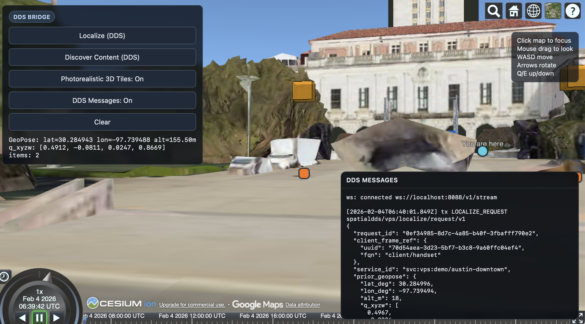
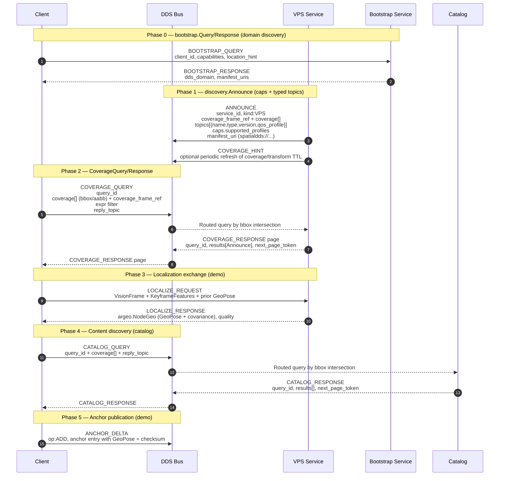

# SpatialDDS v1.4 Demo

This repo tracks the SpatialDDS 1.4 draft and runs on CycloneDDS. It bundles the upstream IDL under `idl/v1.4`, mirrors the manifest examples in `manifests/v1.4`, and provides a runnable mock flow that follows the new Discovery model and sensing/anchor shapes.



## Web Demo (DDS Bridge)

Create `web/.env.local` with required values:
```bash
VITE_CESIUM_ION_TOKEN=your_token
VITE_CESIUM_ION_ASSET_ID=your_asset_id
VITE_SPATIALDDS_BRIDGE_URL=http://localhost:8088
```

Run the DDS-backed bridge in Docker, then start the web UI on the host:

```bash
# Start VPS + catalog + bridge (Docker)
./run_bridge_server_docker.sh

# Verify bridge is reachable
curl http://localhost:8088/health

# Start web UI (host)
cd web
npm install
npm run dev
```

Logs are written to `bridge/logs/`:
- `bridge/logs/vps_server_<timestamp>.log`
- `bridge/logs/catalog_server_<timestamp>.log`
- `bridge/logs/bridge_server_<timestamp>.log`

Stop the bridge when done:
```bash
./stop_bridge_server_docker.sh
```

## Protocol Flow (v1.4)



## Quick Start (non-web)

```bash
# Full mock + DDS bootstrap run with logs
./run_local_tests_with_logs.sh
```

The Dockerfile pulls a prebuilt base image with Cyclone DDS + idlc + Python bindings:
`ghcr.io/openarcloud/cyclonedds-python-base:0.10.5-ubuntu22.04`.

To rebuild/publish the base image:
```bash
docker build -f Dockerfile.base -t ghcr.io/openarcloud/cyclonedds-python-base:0.10.5-ubuntu22.04 .
docker push ghcr.io/openarcloud/cyclonedds-python-base:0.10.5-ubuntu22.04
```

## DDS Demo (controlling services separately)

The DDS transport uses a single envelope topic (`spatialdds/envelope/v1`) and requires
Cyclone DDS to be enabled explicitly. The client always starts with bootstrap
domain discovery.

Use `--summary-only` for headers only, or omit it for full message details.

If running directly on the host instead of Docker, you must install the
Cyclone DDS Python bindings (`cyclonedds==0.10.5`) and ensure `idlc` is on PATH.

### Self-Echo Filtering

The demo drops DDS envelopes that appear to be sent by the same process to avoid
self-echo on the shared envelope topic. Sender identity is inferred from payload
fields (for example, `from`, `source_id`, `sender_id`, or
`client_frame_ref.fqn`).

### Bootstrap Flow

The bootstrap service runs on DDS domain 0 and returns the domain to use for the
actual SpatialDDS demo. Start it first, then run the VPS and catalog servers on
the returned domain (default: 1). The client queries the bootstrap service and
switches domains automatically.

```bash
# Bootstrap server (domain 0, Docker)
docker run --rm --network host \
  -e SPATIALDDS_TRANSPORT=dds \
  -e SPATIALDDS_DDS_DOMAIN=0 \
  -e CYCLONEDDS_URI=file:///etc/cyclonedds.xml \
  cyclonedds-python python3 spatialdds_bootstrap_server.py --domain 1

# VPS server (domain 1, Docker)
docker run --rm --network host \
  -e SPATIALDDS_TRANSPORT=dds \
  -e SPATIALDDS_DDS_DOMAIN=1 \
  -e CYCLONEDDS_URI=file:///etc/cyclonedds.xml \
  cyclonedds-python python3 spatialdds_vps_server.py

# Catalog server (domain 1, Docker)
docker run --rm --network host \
  -e SPATIALDDS_TRANSPORT=dds \
  -e SPATIALDDS_DDS_DOMAIN=1 \
  -e CYCLONEDDS_URI=file:///etc/cyclonedds.xml \
  cyclonedds-python python3 spatialdds_catalog_server.py

# Client (starts on domain 0, switches to domain 1)
docker run --rm --network host \
  -e SPATIALDDS_TRANSPORT=dds \
  -e SPATIALDDS_DDS_DOMAIN=0 \
  -e CYCLONEDDS_URI=file:///etc/cyclonedds.xml \
  cyclonedds-python python3 spatialdds_demo_client.py
```

## HTTP Binding

```bash
# Start the REST API
python3 http_binding.py

# Register an announce
curl -X POST http://localhost:8080/.well-known/spatialdds/register \
  -H "Content-Type: application/json" \
  -d @manifests/v1.4/vps_manifest.json

# Search by coverage
curl -X POST http://localhost:8080/.well-known/spatialdds/search \
  -H "Content-Type: application/json" \
  -d '{
    "coverage": [{"type":"bbox","has_crs":true,"crs":"EPSG:4979","has_bbox":true,"bbox":[-122.45,37.75,-122.35,37.85],"has_aabb":false,"global":false,"has_frame_ref":false}],
    "coverage_frame_ref": {"uuid":"00000000-0000-0000-0000-000000000000","fqn":"earth-fixed"},
    "expr": "kind==\"VPS\""
  }'
```

## Repository Layout

```
.
├── idl/v1.4/                 # Canonical IDL pulled from SpatialDDS-spec
├── manifests/v1.4/           # Manifest examples from SpatialDDS-spec
├── spatialdds_test.py        # v1.4 discovery + localization demo
├── spatialdds_validation.py  # FrameRef/Time/Coverage/GeoPose helpers
├── http_binding.py           # REST wrapper for discovery payloads
└── spatialdds.idl            # Convenience include aggregator for idlc
```
