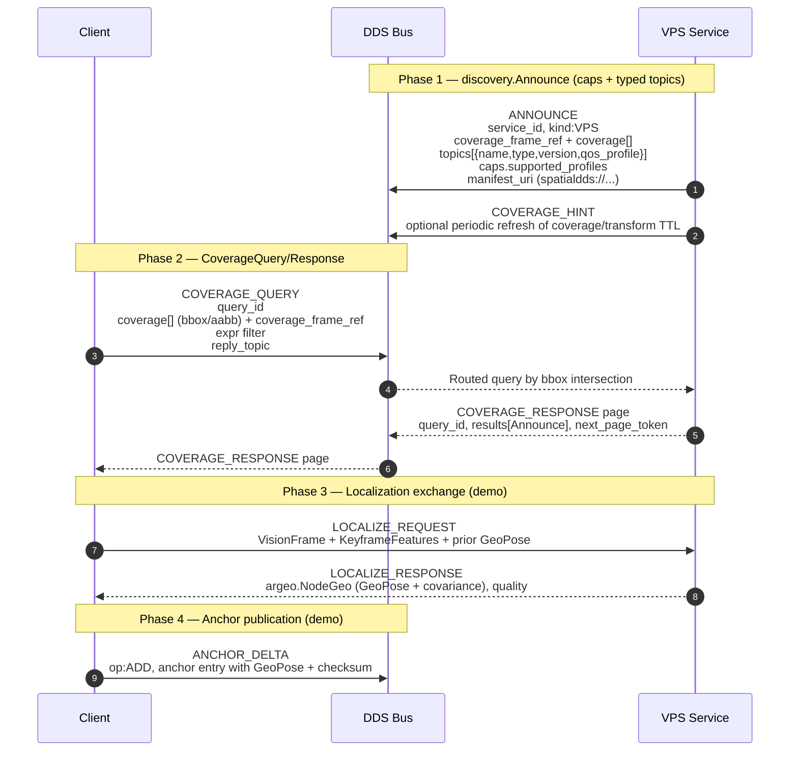

# SpatialDDS v1.4 Demo

This repo tracks the SpatialDDS 1.4 draft. It bundles the upstream IDL under `idl/v1.4`, mirrors the manifest examples in `manifests/v1.4`, and provides a runnable mock flow that follows the new Discovery model and sensing/anchor shapes.

## What's Inside
- v1.4 IDL bundle with a convenience `spatialdds.idl` wrapper
- Discovery walkthrough using `disco.Announce` + `disco.CoverageQuery/Response`
- Mock VPS-style localization built from 1.4 primitives (`core.GeoPose`, `sensing.vision`, `argeo.NodeGeo`)
- HTTP REST binding that mirrors the 1.4 discovery payloads
- Validation helpers for Time, FrameRef, coverage elements, GeoPose quaternions
- Docker image for quick runs and IDL compilation

## Protocol Flow (v1.4)



## Quick Start

```bash
# Build the Docker image
docker build -t cyclonedds-python .

# If the build fails on cyclonedds bindings, rebuild clean
# (the image requires cyclonedds==0.10.5 and will fail if missing)
docker build -t cyclonedds-python --no-cache .

# Run the SpatialDDS v1.4 demo (mock transport)
docker run --rm --network host cyclonedds-python
```

The Dockerfile pulls a prebuilt base image with Cyclone DDS + idlc + Python bindings:
`ghcr.io/openarcloud/cyclonedds-python-base:0.10.5-ubuntu22.04`.

To rebuild/publish the base image:
```bash
docker build -f Dockerfile.base -t ghcr.io/openarcloud/cyclonedds-python-base:0.10.5-ubuntu22.04 .
docker push ghcr.io/openarcloud/cyclonedds-python-base:0.10.5-ubuntu22.04
```

## DDS Two-Process Demo (Cyclone DDS)

The DDS transport uses a single envelope topic (`spatialdds/envelope/v1`) and requires
Cyclone DDS to be enabled explicitly.

```bash
# In one terminal (server, Docker)
docker run --rm --network host \
  -e SPATIALDDS_TRANSPORT=dds \
  -e SPATIALDDS_DDS_DOMAIN=0 \
  -e CYCLONEDDS_URI=file:///etc/cyclonedds.xml \
  cyclonedds-python python3 spatialdds_demo_server.py

# In another terminal (catalog server, Docker)
docker run --rm --network host \
  -e SPATIALDDS_TRANSPORT=dds \
  -e SPATIALDDS_DDS_DOMAIN=0 \
  -e CYCLONEDDS_URI=file:///etc/cyclonedds.xml \
  cyclonedds-python python3 spatialdds_catalog_server.py

# In another terminal (client, Docker)
docker run --rm --network host \
  -e SPATIALDDS_TRANSPORT=dds \
  -e SPATIALDDS_DDS_DOMAIN=0 \
  -e CYCLONEDDS_URI=file:///etc/cyclonedds.xml \
  cyclonedds-python python3 spatialdds_demo_client.py
```

Use `--summary-only` for headers only, or omit it for full message details.

If running directly on the host instead of Docker, you must install the
Cyclone DDS Python bindings (`cyclonedds==0.10.5`) and ensure `idlc` is on PATH.

## Run Tests

```bash
# Default: full logs
python3 spatialdds_test.py

# Summary only
python3 spatialdds_test.py --summary-only

# Validation utilities self-test
python3 spatialdds_validation.py

# Full suite wrapper
./run_all_tests.sh
```

## HTTP Binding

```bash
# Start the REST API
python3 http_binding.py

# Register an announce
curl -X POST http://localhost:8080/.well-known/spatialdds/register \
  -H "Content-Type: application/json" \
  -d @manifests/v1.4/vps_manifest.json

# Search by coverage
curl -X POST http://localhost:8080/.well-known/spatialdds/search \
  -H "Content-Type: application/json" \
  -d '{
    "coverage": [{"type":"bbox","has_crs":true,"crs":"EPSG:4979","has_bbox":true,"bbox":[-122.45,37.75,-122.35,37.85],"has_aabb":false,"global":false,"has_frame_ref":false}],
    "coverage_frame_ref": {"uuid":"00000000-0000-0000-0000-000000000000","fqn":"earth-fixed"},
    "expr": "kind==\"VPS\""
  }'
```

## Repository Layout

```
.
├── idl/v1.4/                 # Canonical IDL pulled from SpatialDDS-spec
├── manifests/v1.4/           # Manifest examples from SpatialDDS-spec
├── spatialdds_test.py        # v1.4 discovery + localization demo
├── spatialdds_validation.py  # FrameRef/Time/Coverage/GeoPose helpers
├── http_binding.py           # REST wrapper for discovery payloads
├── run_all_tests.sh          # Convenience test runner
└── spatialdds.idl            # Convenience include aggregator for idlc
```
