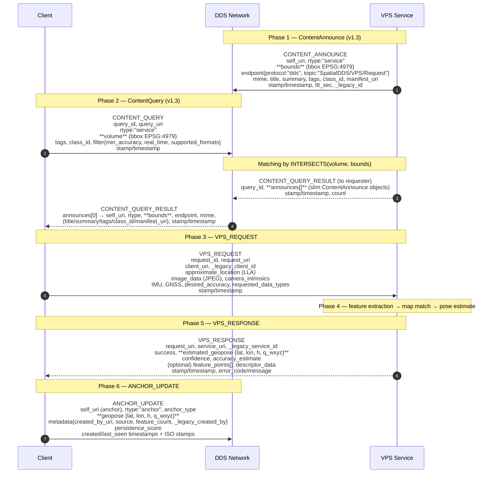
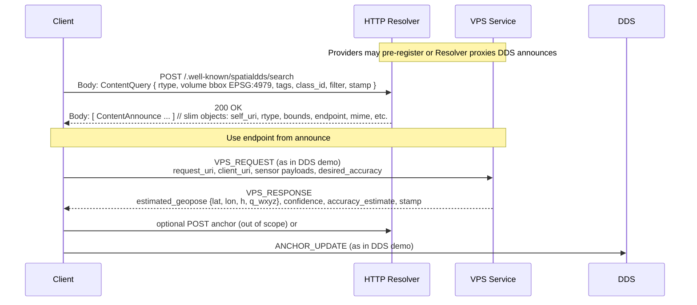

# Cyclone DDS Docker with SpatialDDS Implementation

A dockerized setup for Eclipse Cyclone DDS with SpatialDDS protocol implementation, including comprehensive test applications for both basic DDS functionality and SpatialDDS VPS (Visual Positioning Service) scenarios.

## Overview

This project provides:
- Docker container with Cyclone DDS built from source
- **Complete SpatialDDS v1.3 protocol implementation** (updated from v1.2)
- VPS (Visual Positioning Service) mock implementation
- HTTP binding with REST API endpoints for content discovery
- Validation utilities for URIs, coverage, and quaternions
- Comprehensive test suite with detailed message logging
- IDL definitions for SpatialDDS v1.3 data structures
- Docker Compose configuration for distributed testing

## SpatialDDS v1.3 Features

This implementation includes all v1.3 specification updates:

1. **URI-based Identification**: Resources use `spatialdds://` URIs alongside legacy IDs
2. **Enhanced Coverage Model**: New `CoverageElement` structure with frame, CRS, and geometry types
3. **Quaternion Normalization**: Support for `q_wxyz` [w,x,y,z] format with validation
4. **Frame Metadata**: Poses include explicit frame references (earth-fixed, local, map, anchor)
5. **ContentQuery/ContentAnnounce**: Updated discovery protocol (replaces ServiceAnnouncement)
6. **HTTP Binding**: REST API at `/.well-known/spatialdds/search` for web integration
7. **Validation**: Comprehensive validation for all v1.3 structures

## Protocol Flow

### DDS-based Communication



### HTTP-based Communication



## Prerequisites

- Docker (version 20.10 or later)
- Docker Compose (version 2.0 or later)

## Quick Start

### 1. Build the Docker Image

```bash
docker build -t cyclonedds-python .
```

**Note:** The build includes all v1.3 files:
- `spatialdds.idl` - v1.3 IDL definitions
- `spatialdds_test.py` - v1.3 protocol test
- `spatialdds_validation.py` - Validation utilities
- `http_binding.py` - HTTP REST API server

### 2. Run Comprehensive Tests

Test both DDS and SpatialDDS v1.3 functionality:

```bash
docker run --rm --network host cyclonedds-python
```

Or run the v1.3 test directly:

```bash
docker run --rm --network host cyclonedds-python python3 spatialdds_test.py
```

This validates:
- Cyclone DDS environment setup and basic functionality
- SpatialDDS v1.3 IDL compilation
- ContentAnnounce/ContentQuery discovery protocol
- VPS request/response with normalized quaternions
- Frame-aware poses with URI-based identification
- Anchor updates with v1.3 format
- Detailed message logging and protocol visualization

### 3. Run Publisher/Subscriber Test

Using Docker Compose to run both publisher and subscriber:

```bash
# Start both services
docker-compose up

# Or run in detached mode
docker-compose up -d

# View logs
docker-compose logs -f
```

## Usage Options

### SpatialDDS v1.3 Tests

Run the v1.3 protocol test (demonstrates all new features):
```bash
# Default: Show message content with v1.3 features
docker run --rm --network host cyclonedds-python python3 spatialdds_test.py

# Show detailed content including full sensor data
docker run --rm --network host cyclonedds-python python3 spatialdds_test.py --detailed

# Show only message headers (no content)
docker run --rm --network host cyclonedds-python python3 spatialdds_test.py --summary-only
```

### Validation Tests

Test v1.3 validation utilities:
```bash
docker run --rm cyclonedds-python python3 spatialdds_validation.py
```

### HTTP Binding Server

Start the HTTP REST API server:
```bash
# Start server on port 8080
docker run --rm -p 8080:8080 cyclonedds-python python3 http_binding.py

# Custom port
docker run --rm -p 9000:9000 cyclonedds-python python3 http_binding.py --port 9000
```

Test the HTTP endpoints:
```bash
# Search for content
curl -X POST http://localhost:8080/.well-known/spatialdds/search \
  -H "Content-Type: application/json" \
  -d '{
    "rtype": "service",
    "volume": {
      "elements": [{
        "type": "bbox",
        "frame": "earth-fixed",
        "crs": "EPSG:4979",
        "bbox": [-122.5, 37.7, 0, -122.3, 37.8, 100]
      }]
    }
  }'

# Register content
curl -X POST http://localhost:8080/.well-known/spatialdds/register \
  -H "Content-Type: application/json" \
  -d @example_content_announce.json

# List all content
curl http://localhost:8080/.well-known/spatialdds/list
```

### Built-in Tests

Run the comprehensive test suite (legacy tests):
```bash
docker run --rm --network host cyclonedds-python

# Or specific test modes
docker run --rm --network host cyclonedds-python python3 comprehensive_test.py --mode spatial
```

### DDS Performance Tools

Test throughput:
```bash
docker run --rm --network host cyclonedds-python ddsperf pub size 1k &
docker run --rm --network host cyclonedds-python ddsperf sub
```

Test latency:
```bash
docker run --rm --network host cyclonedds-python ddsperf ping &
docker run --rm --network host cyclonedds-python ddsperf pong
```

Run sanity check:
```bash
docker run --rm --network host cyclonedds-python ddsperf sanity
```

### IDL Compiler

Compile IDL files:
```bash
docker run --rm -v $(pwd):/data cyclonedds-python idlc /data/your_file.idl
```

### SpatialDDS v1.3 Protocol Testing

The v1.3 test demonstrates:
1. **ContentAnnounce**: VPS announces capabilities using v1.3 format with URI and coverage
2. **ContentQuery**: Client discovers services using spatial volume queries
3. **URI Validation**: Automatic validation of `spatialdds://` URIs
4. **Coverage Intersection**: Spatial matching using CoverageElement structure
5. **Sensor Data Exchange**: Mock camera, IMU, and GPS data transmission
6. **Pose Estimation**: VPS returns poses with normalized quaternions (wxyz) and frame metadata
7. **Feature Extraction**: Visual feature points and descriptors
8. **Anchor Management**: Persistent world-anchored reference points with v1.3 structure
9. **Detailed Logging**: Complete message flow with JSON content visualization

#### Message Content Display Options:
- **Default Mode**: Shows all message content with large data fields truncated for readability
- **Detailed Mode**: Shows complete message content including full sensor data payloads
- **Summary Mode**: Shows only message headers, timing, and sizes without content
- **Custom Fields**: Key fields like URIs, request_id, success status, and confidence are always shown

### Compile SpatialDDS IDL

Generate code from v1.3 IDL definitions:
```bash
# Generate Python bindings
docker run --rm -v $(pwd):/output cyclonedds-python idlc -l py -o /output spatialdds.idl

# Generate C bindings
docker run --rm -v $(pwd):/output cyclonedds-python idlc -l c -o /output spatialdds.idl
```

## Network Configuration

This setup uses `network_mode: host` for Docker containers to ensure proper DDS communication. This is required because:

- DDS uses UDP multicast for discovery
- Host networking allows containers to communicate using the host's network interface
- Proper IP addressing is maintained for DDS participants

**Note**: Host networking may not work on Docker Desktop for Windows/macOS. In these environments, you may need to adjust the network configuration.

## Project Structure

```
.
├── Dockerfile                  # Multi-stage build for Cyclone DDS
├── docker-compose.yml          # Container orchestration
├── requirements.txt            # Python dependencies
├── spatialdds.idl             # v1.3 IDL definitions
├── spatialdds_test.py         # v1.3 protocol test suite
├── spatialdds_validation.py   # v1.3 validation utilities
├── http_binding.py            # HTTP REST API server
├── comprehensive_test.py      # DDS + SpatialDDS test suite
├── run_all_tests.sh           # Test runner script
├── SPEC_COMPLIANCE.md         # v1.3 spec compliance documentation
├── DOCKER_GUIDE.md            # Docker usage reference
├── CONTRIBUTING.md            # Contribution guidelines
├── LICENSE                    # MIT license
└── README.md                  # This file
```

## Dockerfile Details

The Dockerfile uses a multi-stage build:

1. **Builder stage**: Compiles Cyclone DDS from source with required features
2. **Runtime stage**: Creates a lean production image with Python bindings

Key features:
- Based on Python 3.10 (3.11 has known installation issues)
- Cyclone DDS built with `ENABLE_TYPELIB=ON`
- Non-root user for security
- Proper environment variable setup

## Troubleshooting

### Common Issues

1. **Import Error**: If you see `ImportError: cannot import name 'IdlStruct'`
   - This usually indicates cyclonedds installation issues
   - Rebuild the Docker image with `--no-cache` flag

2. **Network Issues**: If containers can't communicate
   - Ensure host networking is working on your platform
   - Check firewall settings for UDP ports 7400-7500

3. **Build Failures**: If Docker build fails
   - Check available disk space
   - Ensure internet connectivity for downloading dependencies

### Validation Commands

```bash
# Check if Cyclone DDS is properly installed
docker run --rm cyclonedds-python cyclonedds --version

# Check Python bindings
docker run --rm cyclonedds-python python -c "import cyclonedds; print('Success')"

# Run comprehensive test
docker run --rm --network host cyclonedds-python python test_app.py --mode test
```

### Debug Mode

Run with verbose output:

```bash
docker run --rm --network host -e CYCLONEDDS_URI='<General><NetworkInterfaceAddress>auto</NetworkInterfaceAddress></General>' cyclonedds-python
```

## Development

To modify and test the implementation:

```bash
# Test SpatialDDS changes without rebuilding
docker run --rm --network host -v $(pwd):/app cyclonedds-python python3 spatialdds_test.py

# Test HTTP binding
docker run --rm -p 8080:8080 -v $(pwd):/app cyclonedds-python python3 http_binding.py
```

## Contributing

Issues and pull requests are welcome. See the [CONTRIBUTING](CONTRIBUTING) file for more details.

## License

See the [LICENSE](LICENSE) file for details.

## v1.3 Specification Compliance

This implementation is **fully compliant** with SpatialDDS v1.3 specification:

- ✅ URI-based identification with `spatialdds://` scheme
- ✅ Earth-fixed bbox as 2D `[west, south, east, north]`
- ✅ GeoPose format `{lat, lon, h, q_wxyz}` for earth-fixed frames
- ✅ Single canonical quaternion format `q_wxyz` [w,x,y,z]
- ✅ Slim announce payloads with `bounds` (single CoverageElement)
- ✅ Query `volume` as single CoverageElement
- ✅ ISO8601 timestamps alongside epoch milliseconds
- ✅ Omitted redundant fields (pose_frame, empty arrays)

See [SPEC_COMPLIANCE.md](SPEC_COMPLIANCE.md) for detailed before/after examples and all 11 refinements.

## References

- [SpatialDDS Specification v1.3](https://github.com/OpenArCloud/SpatialDDS-spec/blob/main/SpatialDDS-1.3-full.md) - Official v1.3 specification
- [SpatialDDS v1.3 IDL](https://github.com/OpenArCloud/SpatialDDS-spec/tree/main/idl/v1.3) - Official IDL definitions
- [SpatialDDS Specification Repository](https://github.com/OpenArCloud/SpatialDDS-spec) - Full specification with examples
- [Eclipse Cyclone DDS](https://github.com/eclipse-cyclonedds/cyclonedds)
- [Cyclone DDS Python Bindings](https://github.com/eclipse-cyclonedds/cyclonedds-python)
- [DDS Documentation](https://cyclonedds.io/docs/)
