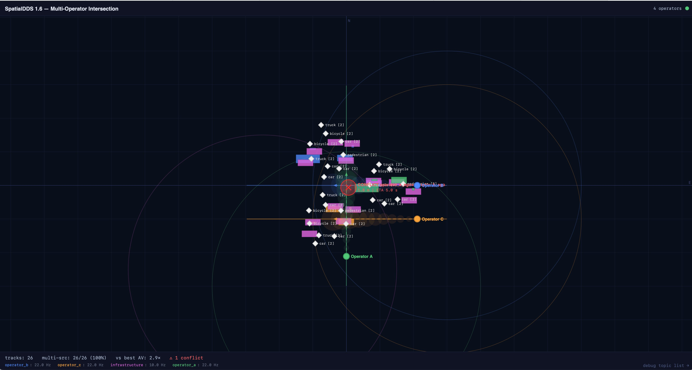

# SpatialDDS Demo

Reference demos for the SpatialDDS 1.7 draft spec (https://spatialdds.org), running
on CycloneDDS. The repo bundles the upstream IDL under `idl/v1.7`, mirrors the
manifest examples in `manifests/v1.7`, and ships four runnable demos that build on
top of a shared `spatialdds/envelope/v1` transport.

> **1.7 is a hard cutover.** Under the spec's pre-adoption instability clause,
> 1.7 breaks the wire format: `CoverageResponse` returns compact `ServiceSummary`
> rows, `CoverageQuery.expr` and `CoverageElement.type` are gone, `GeoPose` lost
> `frame_kind`/`frame_ref`, and every module now versions together as
> `spatial.<profile>/1.7` (the `name@MAJOR.MINOR` form is retired). This repo
> carries no compatibility shims. `idl/v1.4`, `idl/v1.6`, `manifests/v1.4` and
> `manifests/v1.6` are retained only as inert historical reference — nothing
> loads them. See [`ar_demo/SPEC_COMPLIANCE.md`](ar_demo/SPEC_COMPLIANCE.md).

## Demos in this repo

| Demo | Path | What it shows |
|---|---|---|
| **Multi-operator fusion** *(flagship)* | [`multi_operator_fusion/`](multi_operator_fusion/README.md) | Three AV fleet operators + one 6G base station share `Detection3D` observations. A platform fuser does NN-gated track fusion and publishes unified `FusedTrack`s. Rerun renders per-operator split-screen + fused view. |
| **nuScenes → SpatialDDS → Rerun** | [`nuscenes/`](nuscenes/README.md) | Publishes nuScenes v1.0-mini AV data (ego pose, 6 cameras, LiDAR, 5 radars, 3D annotations) over DDS envelopes; visualizes in Rerun. |
| **DeepSense 6G → SpatialDDS → Rerun** | [`deepsense/`](deepsense/README.md) | Publishes DeepSense 6G Scenario 9 V2I data (60 GHz phased-array beam, FMCW radar, camera, GPS, 2D lidar) over DDS envelopes. |
| **AR demo** | [`ar_demo/`](ar_demo/README.md) | Bootstrap → discovery → coverage query → localization → catalog → anchor flow for AR clients. Includes a Cesium web UI backed by an HTTP-to-DDS bridge ([`bridges/web_bridge/`](bridges/web_bridge/README.md)). |
| **Benchmarks** | [`benchmarks/`](benchmarks/README.md) | Latency, discovery, multi-operator, and coverage-query benchmark scripts + plotting. |

If you're new here, start with **multi-operator fusion** — it exercises the full
envelope transport with real datasets.

## Bridges

Protocol bridges live under [`bridges/`](bridges/) and work with every demo above
without per-demo wiring:

| Bridge | Path | What it does |
|---|---|---|
| **Web (HTTP/WebSocket)** | [`bridges/web_bridge/`](bridges/web_bridge/README.md) | FastAPI server with two surfaces: legacy REST endpoints (`/v1/localize`, `/v1/catalog/query`, `/v1/stream`) for the Cesium demo, plus a generic subscribe-based protocol (`/ws`, `/api/topics`, `/api/stats`) so any browser app can listen to or publish envelopes by topic pattern with optional rate limits. Ships a 2D top-down canvas dashboard at `/` and a topic-list debug page at `/debug`. |
| **MCAP record / replay** | [`bridges/mcap_bridge/`](bridges/mcap_bridge/README.md) | Records `spatialdds/envelope/v1` traffic to an [MCAP](https://mcap.dev) file and replays it back onto a CycloneDDS domain. Lossless (RELIABLE+KEEP_ALL), Foxglove-compatible, no per-demo wiring. |
| **ROS 2** | [`bridges/ros2_bridge/`](bridges/ros2_bridge/README.md) | Bidirectional bridge between SpatialDDS topics and ROS 2 topics. v0 covers `PoseStamped`, `NavSatFix`, `Imu`, `CompressedImage`, `Detection3DArray`, plus `FusedTrackSet` reverse. Conversion layer is duck-typed so 80% is testable without ROS 2 installed. |
| **MQTT** | [`bridges/mqtt_bridge/`](bridges/mqtt_bridge/README.md) | Bidirectional bridge between SpatialDDS and MQTT (local Mosquitto or AWS IoT Core). MQTT topic = SpatialDDS `logical_topic`, payload = same JSON. QoS/retain inferred from topic suffix (meta = retained, frames = best-effort, decisions = at-least-once). Loop prevention via `_bridge_id` + non-overlapping inbound/outbound filters. |

## Two HTTP servers — which one do I want?

| | `ar_demo/http_binding.py` | `bridges/web_bridge/server.py` |
|---|---|---|
| Purpose | Spec-compliance REST wrapper that mirrors the discovery payload shapes | HTTP-to-DDS bridge that the Cesium / canvas dashboard talks to |
| Port (default) | 8080 | 8088 |
| Used by | `ar_demo/run_all_tests.sh`, the [AR demo README](ar_demo/README.md) | `run_bridge_server_docker.sh`, `web/`, `bridges/web_bridge/static/` |
| Run with DDS? | No (in-process registration) | Yes (publishes/subscribes envelopes) |

They are not interchangeable. Use the bridge for the web/canvas demos; use the HTTP
binding when you just want to exercise the registration/search payload shapes.

## Browser UIs

Each demo brings its own browser visualisation — both served by the
[web bridge](bridges/web_bridge/README.md):

- **AR demo** → 3D Cesium-Ion view of VPS coverage + catalog +
  localisation + anchor publication. Run via
  [`ar_demo/README.md`](ar_demo/README.md#cesium-web-ui).
- **Multi-operator fusion** → 2D top-down canvas at
  `http://localhost:8088/` (debug topic-list at `/debug`) — operator
  egos + trails, detection wireframes, planned trajectories, fused
  tracks, conflict markers, live metrics. Run via
  [`multi_operator_fusion/README.md`](multi_operator_fusion/README.md#browser-canvas-dashboard).
