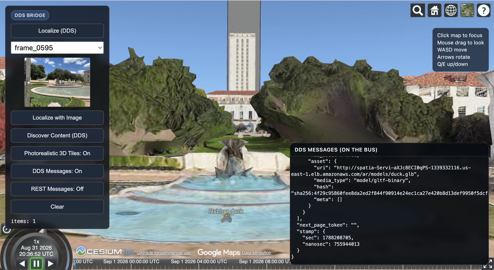
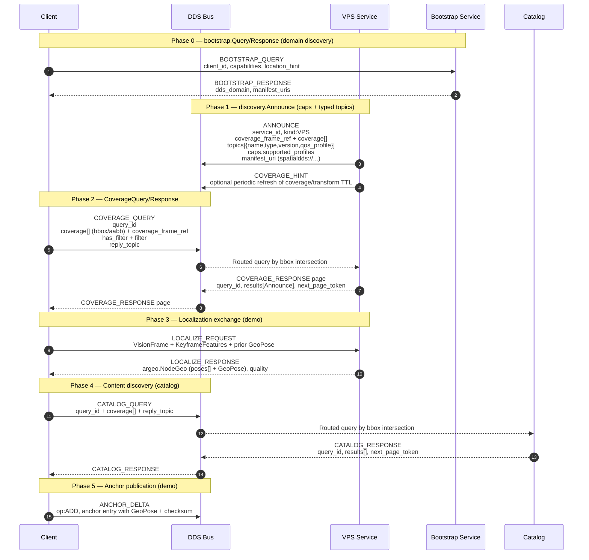

# SpatialDDS Demo

Reference demos for the SpatialDDS 1.6 draft spec (https://spatialdds.org), running on
CycloneDDS. The repo bundles the upstream IDL under `idl/v1.6`, mirrors the manifest
examples in `manifests/v1.6`, and ships four runnable demos that build on top of a shared
`spatialdds/envelope/v1` transport.



## Demos in this repo

| Demo | Path | What it shows |
|---|---|---|
| **Multi-operator fusion** *(flagship)* | [`multi_operator_fusion/`](multi_operator_fusion/README.md) | Three AV fleet operators + one 6G base station share `Detection3D` observations. A platform fuser does NN-gated track fusion and publishes unified `FusedTrack`s. Rerun renders per-operator split-screen + fused view. |
| **nuScenes → SpatialDDS → Rerun** | [`nuscenes/`](nuscenes/README.md) | Publishes nuScenes v1.0-mini AV data (ego pose, 6 cameras, LiDAR, 5 radars, 3D annotations) over DDS envelopes; visualizes in Rerun. |
| **DeepSense 6G → SpatialDDS → Rerun** | [`deepsense/`](deepsense/README.md) | Publishes DeepSense 6G Scenario 9 V2I data (60 GHz phased-array beam, FMCW radar, camera, GPS, 2D lidar) over DDS envelopes. |
| **Core v1.6 protocol demo** | [`core_demo/`](core_demo/) + [`web/`](web/) | Bootstrap → discovery → coverage query → localization → catalog → anchor flow. Includes a Cesium web UI backed by an HTTP-to-DDS bridge ([`bridges/web_bridge/`](bridges/web_bridge/README.md)). |
| **Benchmarks** | [`benchmarks/`](benchmarks/README.md) | Latency, discovery, multi-operator, and coverage-query benchmark scripts + plotting. |

If you're new here, start with **multi-operator fusion** — it exercises the full envelope
transport with real datasets.

## Bridges

Protocol bridges live under [`bridges/`](bridges/) and work with every demo above
without per-demo wiring:

| Bridge | Path | What it does |
|---|---|---|
| **Web (HTTP/WebSocket)** | [`bridges/web_bridge/`](bridges/web_bridge/README.md) | FastAPI server with two surfaces: legacy REST endpoints (`/v1/localize`, `/v1/catalog/query`, `/v1/stream`) for the Cesium demo, plus a generic subscribe-based protocol (`/ws`, `/api/topics`, `/api/stats`) so any browser app can listen to or publish envelopes by topic pattern with optional rate limits. Ships a zero-dep JS client + a minimal debug dashboard. |
| **MCAP record / replay** | [`bridges/mcap_bridge/`](bridges/mcap_bridge/README.md) | Records `spatialdds/envelope/v1` traffic to an [MCAP](https://mcap.dev) file and replays it back onto a CycloneDDS domain. Lossless (RELIABLE+KEEP_ALL), Foxglove-compatible, no per-demo wiring. |
| **ROS 2** | [`bridges/ros2_bridge/`](bridges/ros2_bridge/README.md) | Bidirectional bridge between SpatialDDS topics and ROS 2 topics. v0 covers `PoseStamped`, `NavSatFix`, `Imu`, `CompressedImage`, `Detection3DArray`, plus `FusedTrackSet` reverse. Conversion layer is duck-typed so 80% is testable without ROS 2 installed. |

## Repository layout

Each demo lives in its own folder. Shared infrastructure (the
`spatialdds_demo/` Python package, `spatialdds_test.py`, and
`spatialdds_validation.py`) stays at the repo root because every demo
imports from it.

```
.
├── core_demo/                 # Bootstrap → discovery → coverage → localize → catalog → anchor (v1.6 protocol)
├── multi_operator_fusion/     # Flagship: 3 AV operators + infra → fuser → Rerun
├── nuscenes/                  # nuScenes publisher/subscriber demo
├── deepsense/                 # DeepSense 6G publisher/subscriber demo
├── benchmarks/                # Protocol overhead + scalability benchmarks
├── web/                       # Cesium web UI (talks to bridges/web_bridge/server.py)
├── bridges/
│   ├── web_bridge/            # HTTP-to-DDS bridge powering the web UI
│   ├── mcap_bridge/           # MCAP record/replay tool (works with every demo)
│   └── ros2_bridge/           # ROS 2 ↔ SpatialDDS bridge (5 message types in v0)
├── spatialdds_demo/           # Shared DDS transport + manifest helpers (Python package)
├── spatialdds_test.py         # Shared: v1.6 protocol harness + MockSensorData
├── spatialdds_validation.py   # Shared: FrameRef/Time/Coverage/GeoPose helpers
├── idl/v1.6/                  # Canonical IDL pulled from SpatialDDS-spec
├── manifests/v1.6/            # Manifest examples from SpatialDDS-spec
├── docs/                      # Vendored spec documents
├── Dockerfile                 # Builds the `cyclonedds-python` base image used by every demo
├── Dockerfile.base            # Rebuilds the upstream Cyclone DDS + Python image
├── cyclonedds.xml             # Cyclone DDS config baked into the image
├── requirements.txt           # Shared Python deps (typing-extensions, pytest)
├── run_bridge_server_docker.sh  # Web demo: starts VPS + catalog + bridge in Docker
├── stop_bridge_server_docker.sh
├── run_bridge_http_tests_docker.sh
└── run_bridge_http_tests_with_logs.sh
```

Inside `core_demo/`:

```
core_demo/
├── README.md                  → see DOCKER_GUIDE.md / SPEC_COMPLIANCE.md
├── DOCKER_GUIDE.md            # Docker reference for the core v1.6 demo
├── SPEC_COMPLIANCE.md         # v1.6 compliance notes
├── spatialdds_demo_server.py  # VPS service
├── spatialdds_demo_client.py  # Demo client
├── spatialdds_bootstrap_server.py
├── spatialdds_catalog_server.py
├── spatialdds_demo_tests.py
├── http_binding.py            # Spec-compliance REST wrapper for discovery payloads
├── comprehensive_test.py      # Default Docker entry point
├── spatialdds.idl             # Convenience include aggregator for idlc
├── catalog_seed.json          # Sample catalog data
├── run_all_tests.sh           # Validation + protocol + demo + HTTP-binding tests
└── run_local_tests_with_logs.sh  # Mock + DDS bootstrap run with logs
```

## Two HTTP servers — which one do I want?

| | `core_demo/http_binding.py` | `bridges/web_bridge/server.py` |
|---|---|---|
| Purpose | Spec-compliance REST wrapper that mirrors the discovery payload shapes | HTTP-to-DDS bridge that the Cesium web UI talks to |
| Port (default) | 8080 | 8088 |
| Used by | `run_all_tests.sh`, README HTTP example below | `run_bridge_server_docker.sh`, `web/` |
| Run with DDS? | No (in-process registration) | Yes (publishes/subscribes envelopes) |

They are not interchangeable. Use the bridge for the web demo; use the HTTP binding when
you just want to exercise the registration/search payload shapes.

## Web demo (DDS bridge + Cesium)

Create `web/.env.local` with required values:
```bash
VITE_CESIUM_ION_TOKEN=your_token
VITE_CESIUM_ION_ASSET_ID=your_asset_id
VITE_SPATIALDDS_BRIDGE_URL=http://localhost:8088
```

Run the DDS-backed bridge in Docker, then start the web UI on the host:

```bash
# Start VPS + catalog + bridge (Docker)
./run_bridge_server_docker.sh

# Verify bridge is reachable
curl http://localhost:8088/health

# Start web UI (host)
cd web
npm install
npm run dev
```

Logs are written to `bridges/web_bridge/logs/`:
- `bridges/web_bridge/logs/vps_server_<timestamp>.log`
- `bridges/web_bridge/logs/catalog_server_<timestamp>.log`
- `bridges/web_bridge/logs/bridge_server_<timestamp>.log`

Stop the bridge when done:
```bash
./stop_bridge_server_docker.sh
```

## Core v1.6 protocol flow


```mermaid
sequenceDiagram
    autonumber
    participant Client
    participant DDS as DDS Bus
    participant VPS as VPS Service
    participant Bootstrap as Bootstrap Service

    Note over Client,Bootstrap: Phase 0 — bootstrap.Query/Response (domain discovery)
    Client->>Bootstrap: BOOTSTRAP_QUERY<br/>client_id, capabilities, location_hint
    Bootstrap-->>Client: BOOTSTRAP_RESPONSE<br/>dds_domain, manifest_uris

    Note over VPS,DDS: Phase 1 — discovery.Announce (caps + typed topics)
    VPS->>DDS: ANNOUNCE<br/>service_id, kind:VPS<br/>coverage_frame_ref + coverage[]<br/>topics[{name,type,version,qos_profile}]<br/>caps.supported_profiles<br/>manifest_uri (spatialdds://...)
    VPS->>DDS: COVERAGE_HINT<br/>optional periodic refresh of coverage/transform TTL

    Note over Client,DDS: Phase 2 — CoverageQuery/Response
    Client->>DDS: COVERAGE_QUERY<br/>query_id<br/>coverage[] (bbox/aabb) + coverage_frame_ref<br/>has_filter + filter<br/>reply_topic
    DDS-->>VPS: Routed query by bbox intersection
    VPS-->>DDS: COVERAGE_RESPONSE page<br/>query_id, results[Announce], next_page_token
    DDS-->>Client: COVERAGE_RESPONSE page

    Note over Client,VPS: Phase 3 — Localization exchange (demo)
    Client->>VPS: LOCALIZE_REQUEST<br/>VisionFrame + KeyframeFeatures + prior GeoPose
    VPS-->>Client: LOCALIZE_RESPONSE<br/>argeo.NodeGeo (poses[] + GeoPose), quality

    Note over Client,DDS: Phase 4 — Content discovery (catalog)
    Client->>DDS: CATALOG_QUERY<br/>query_id + coverage[] + reply_topic
    DDS-->>Catalog: Routed query by bbox intersection
    Catalog-->>DDS: CATALOG_RESPONSE<br/>query_id, results[], next_page_token
    DDS-->>Client: CATALOG_RESPONSE

    Note over Client,DDS: Phase 5 — Anchor publication (demo)
    Client->>DDS: ANCHOR_DELTA<br/>op:ADD, anchor entry with GeoPose + checksum
```

## Quick start (core demo, non-web)

```bash
# Full mock + DDS bootstrap run with logs
./core_demo/run_local_tests_with_logs.sh
```

The Dockerfile pulls a prebuilt base image with Cyclone DDS + idlc + Python bindings:
`ghcr.io/openarcloud/cyclonedds-python-base:0.10.5-ubuntu22.04`.

To rebuild/publish the base image:
```bash
docker build -f Dockerfile.base -t ghcr.io/openarcloud/cyclonedds-python-base:0.10.5-ubuntu22.04 .
docker push ghcr.io/openarcloud/cyclonedds-python-base:0.10.5-ubuntu22.04
```

See [`core_demo/DOCKER_GUIDE.md`](core_demo/DOCKER_GUIDE.md) for the full Docker reference for the core demo.
The other demos have their own `run_docker_demo.sh` launchers — see each demo's README.

> The Docker image bakes the core-demo files at a flat `/app/` layout so the
> example commands below (and inside the container) reference them by basename
> regardless of where they live in the host repo.

## Core DDS demo (controlling services separately)

The DDS transport uses a single envelope topic (`spatialdds/envelope/v1`) and requires
Cyclone DDS to be enabled explicitly. The client always starts with bootstrap
domain discovery.

Use `--summary-only` for headers only, or omit it for full message details.

If running directly on the host instead of Docker, you must install the
Cyclone DDS Python bindings (`cyclonedds==0.10.5`) and ensure `idlc` is on PATH.

### Self-echo filtering

The demo drops DDS envelopes that appear to be sent by the same process to avoid
self-echo on the shared envelope topic. Sender identity is inferred from payload
fields (for example, `from`, `source_id`, `sender_id`, or
`client_frame_ref.fqn`).

### Bootstrap flow

The bootstrap service runs on DDS domain 0 and returns the domain to use for the
actual SpatialDDS demo. Start it first, then run the VPS and catalog servers on
the returned domain (default: 1). The client queries the bootstrap service and
switches domains automatically.

```bash
# Bootstrap server (domain 0, Docker)
docker run --rm --network host \
  -e SPATIALDDS_TRANSPORT=dds \
  -e SPATIALDDS_DDS_DOMAIN=0 \
  -e CYCLONEDDS_URI=file:///etc/cyclonedds.xml \
  cyclonedds-python python3 spatialdds_bootstrap_server.py --domain 1

# VPS server (domain 1, Docker)
docker run --rm --network host \
  -e SPATIALDDS_TRANSPORT=dds \
  -e SPATIALDDS_DDS_DOMAIN=1 \
  -e CYCLONEDDS_URI=file:///etc/cyclonedds.xml \
  cyclonedds-python python3 spatialdds_demo_server.py

# Catalog server (domain 1, Docker)
docker run --rm --network host \
  -e SPATIALDDS_TRANSPORT=dds \
  -e SPATIALDDS_DDS_DOMAIN=1 \
  -e CYCLONEDDS_URI=file:///etc/cyclonedds.xml \
  cyclonedds-python python3 spatialdds_catalog_server.py

# Client (starts on domain 0, switches to domain 1)
docker run --rm --network host \
  -e SPATIALDDS_TRANSPORT=dds \
  -e SPATIALDDS_DDS_DOMAIN=0 \
  -e CYCLONEDDS_URI=file:///etc/cyclonedds.xml \
  cyclonedds-python python3 spatialdds_demo_client.py
```

## HTTP binding (spec-compliance wrapper)

```bash
# Start the REST API
python3 core_demo/http_binding.py

# Register a service manifest (spatial.manifest@1.6)
curl -X POST http://localhost:8080/.well-known/spatialdds/register \
  -H "Content-Type: application/json" \
  -d @manifests/v1.6/vps_manifest.json

# Search by coverage
curl -X POST http://localhost:8080/.well-known/spatialdds/search \
  -H "Content-Type: application/json" \
  -d '{
    "coverage": [{"type":"bbox","has_crs":true,"crs":"EPSG:4979","has_bbox":true,"bbox":[-122.45,37.75,-122.35,37.85],"has_aabb":false,"global":false,"has_frame_ref":false}],
    "coverage_frame_ref": {"uuid":"00000000-0000-0000-0000-000000000000","fqn":"earth-fixed"},
    "has_filter": true,
    "filter": { "type_in": [], "qos_profile_in": [], "module_id_in": [] },
    "expr": ""
  }'
```
