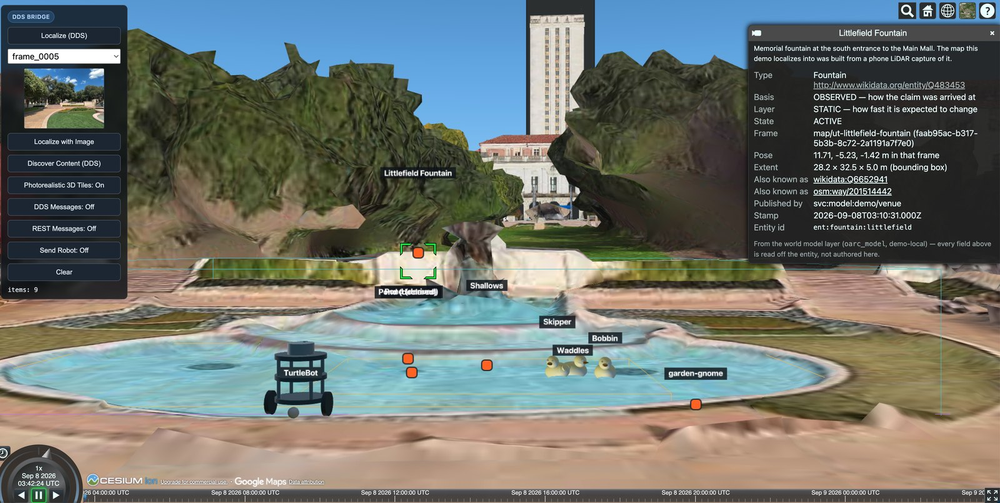

# SpatialDDS Demo



Reference demos for **SpatialDDS 1.7** — the stamped release, 2026-08-23, tag
`v1.7` — running on CycloneDDS. The repo vendors that release's IDL verbatim
under [`idl/v1.7`](idl/v1.7), mirrors its manifest examples in
[`manifests/v1.7`](manifests/v1.7), and ships five runnable demos.

The spec lives at [spatialdds.org](https://spatialdds.org); its source is
[OpenArCloud/SpatialDDS-spec](https://github.com/OpenArCloud/SpatialDDS-spec).

## The two ISMAR demos

Both need Docker. The web UI also needs Node.

### 1 · SpatialDDS + OpenVPS

A browser localizes against a real visual positioning service it discovered on
the bus — no configured endpoint, no per-service client code.

```bash
./run_bridge_server_docker.sh          # VPS + catalogue + bridge on :8088
cd web && npm install && npm run dev   # → http://localhost:5173/
```

Turn on **REST Messages** and **DDS Messages**, then click **Localize**. The
REST panel shows the three calls the browser makes — discovery search, localize,
model snapshot — and the DDS panel the five bus messages they cause.

The bundled localizer returns the prior plus jitter. For poses computed from
pixels, put a real [OpenVPS](https://github.com/OpenArCloud/openvps) on the bus
— nothing here changes, discovery simply finds it instead.
**[Full recipe →](docs/ismar-openvps.md)**

### 2 · Open World Model

The venue as a live model rather than a list of files: entities with identity,
pose, type, basis and relationships. A robot plans against the venue's own
declarations; ducks follow the water; every claim says how it was arrived at.

```bash
SPATIALDDS_MODEL_LAYER=1 SPATIALDDS_POND_WATCH=1 ./run_bridge_server_docker.sh
scripts/run_robot_tier.sh              # second terminal: nav2 plans the routes
cd web && npm run dev                  # → http://localhost:5173/
```

The screenshot above is that view. **[Full recipe →](docs/ismar-owm.md)** —
including the ROS 2 robot tier, which is what makes the keep-out real.

## Demos

| Demo | Path | What it shows |
|---|---|---|
| **SpatialDDS + OpenVPS** | [`ar_demo/`](ar_demo/README.md) | Bootstrap → discovery → coverage query → localization → catalog → anchor, on a Cesium globe. Runs against real [OpenVPS](https://github.com/OpenArCloud/openvps). |
| **Open World Model** | [`docs/world-model.md`](docs/world-model.md) | Entities, relationships, basis and lifecycle on latched topics; a ROS 2 robot planning against declared keep-outs. Prototype, demo-local. |
| Multi-operator fusion | [`multi_operator_fusion/`](multi_operator_fusion/README.md) | Three AV fleet operators and a 6G base station share `Detection3D`; a platform fuser publishes unified `FusedTrack`s. |
| nuScenes → Rerun | [`nuscenes/`](nuscenes/README.md) | nuScenes v1.0-mini as typed samples: ego pose, 6 cameras, LiDAR, 5 radars, 3D annotations. |
| DeepSense 6G → Rerun | [`deepsense/`](deepsense/README.md) | DeepSense Scenario 9 V2I: 60 GHz beam, FMCW radar, camera, GPS, 2D lidar. |
| Benchmarks | [`benchmarks/`](benchmarks/README.md) | Latency, discovery, multi-operator and coverage-query scripts, with plotting. |

## Bridges

Under [`bridges/`](bridges/), and they work with every demo above without
per-demo wiring.

| Bridge | Path | What it does |
|---|---|---|
| Web (HTTP/WebSocket) | [`bridges/web_bridge/`](bridges/web_bridge/README.md) | FastAPI gateway. REST for the Cesium demo, subscribe-by-pattern `/ws`, `/api/topics`, and the fusion dashboard at `/`. |
| MCAP record / replay | [`bridges/mcap_bridge/`](bridges/mcap_bridge/README.md) | Records typed samples with schemas **generated from the IDL**, so a recording is readable without this repo. Foxglove-compatible. |
| ROS 2 | [`bridges/ros2_bridge/`](bridges/ros2_bridge/README.md) | Bidirectional: `PoseStamped`, `NavSatFix`, `Imu`, `CompressedImage`, `Detection3DArray`, and `FusedTrackSet` in reverse. |
| MQTT | [`bridges/mqtt_bridge/`](bridges/mqtt_bridge/README.md) | Bidirectional, against Mosquitto or AWS IoT Core. Inbound JSON is built into its announced type before it reaches the bus. |

There are **two** HTTP servers — a gateway and a conformance harness — and they
are not interchangeable: [which one do I want?](docs/servers-and-uis.md)

## Conformance, in one line

**The demos publish spec IDL types on spec-named topics with spec QoS
profiles.** JSON exists only at the edges — WebSocket clients, MQTT payloads,
MCAP records.

That is verifiable rather than asserted:
[`tests/interop_probe.py`](tests/interop_probe.py) is a participant built from
the generated types, the spec's topic names and the §3.3.3 profile table, with
**no demo transport code**, and it exchanges samples with the demo in both
directions.

> **The pin is the `v1.7` tag, not the spec repo's `main`**, which is now the
> 1.8 draft. Resyncing from main would mix draft IDL into a demo that documents
> itself as 1.7 conformant, and the drift gate would not catch it — generated
> output always matches whatever is vendored. Reasoning and resync instructions
> are in [`scripts/generate_types.py`](scripts/generate_types.py).

## Everything else

- **Tests** — `scripts/run_tests.sh` (~20 s) or `scripts/run_tests.sh standard`
  (~3 min, adds the container suites).
- **AWS** — [`deploy/aws/`](deploy/aws/README.md).
- **Contributing, and the lessons this repo has paid for** —
  [`CONTRIBUTING.md`](CONTRIBUTING.md).
- **The spec text, vendored** — [`docs/SpatialDDS-1.7-full.md`](docs/SpatialDDS-1.7-full.md).
