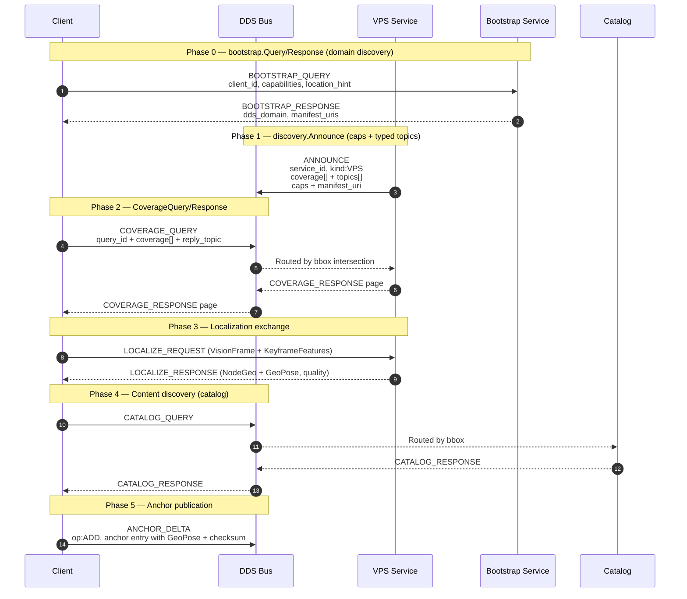

# AR Demo

Bootstrap → discovery → coverage query → localization → catalog → anchor.
The cold-start flow an AR client follows: find a VPS that covers your
area, get a 6DoF localisation, discover content, publish anchors.
Exercised against the canonical IDL bundled at
[`../idl/v1.7`](../idl/v1.7) and the manifests at
[`../manifests/v1.7`](../manifests/v1.7).


## Protocol flow



## Run the protocol flow

The end-to-end flow against a real DDS bus, with all four services + a
client, written to log files:

```bash
./run_local_tests_with_logs.sh
```

Builds the `cyclonedds-python` image on first run from the repo
[`Dockerfile`](../Dockerfile). For the full per-service Docker
reference see [`DOCKER_GUIDE.md`](DOCKER_GUIDE.md). Spec-compliance
notes live in [`SPEC_COMPLIANCE.md`](SPEC_COMPLIANCE.md).

## Cesium web UI

A 3D Cesium-Ion visualisation of the AR demo's VPS + catalog services
lives under [`../web/`](../web/). It speaks to the
[web bridge](../bridges/web_bridge/README.md), which fronts the AR
demo's services on `http://localhost:8088`.

```bash
# 1. Configure the Cesium client (from repo root)
cat > web/.env.local <<'EOF'
VITE_CESIUM_ION_TOKEN=<your token>
VITE_CESIUM_ION_ASSET_ID=<your asset id>
VITE_SPATIALDDS_BRIDGE_URL=http://localhost:8088
EOF

# 2. Start the bridge + VPS + catalog stack (Docker)
../run_bridge_server_docker.sh

# 3. Verify the bridge is reachable
curl http://localhost:8088/health

# 4. Start the web UI
cd ../web && npm install && npm run dev
```

Stop the bridge when done with `../stop_bridge_server_docker.sh`.
Logs land under `../bridges/web_bridge/logs/`.

## HTTP binding (spec-compliance wrapper, no DDS)

`http_binding.py` is a REST wrapper for the discovery payload shapes —
useful when you just want to exercise the registration/search shapes
without standing up DDS. Distinct from the live web bridge, which
talks to a real DDS bus.

```bash
# Start the REST API (default port 8080)
python3 http_binding.py

# Register a service manifest
curl -X POST http://localhost:8080/.well-known/spatialdds/register \
  -H "Content-Type: application/json" \
  -d @../manifests/v1.7/vps_manifest.json

# Fetch the bootstrap manifest
curl http://localhost:8080/.well-known/spatialdds/bootstrap

# Search by coverage. 1.7 removed CoverageElement.type and CoverageQuery.expr;
# `filter` is the only query form.
curl -X POST http://localhost:8080/.well-known/spatialdds/search \
  -H "Content-Type: application/json" \
  -d '{"coverage":[{"has_crs":true,"crs":"EPSG:4979",
       "has_bbox":true,"bbox":[-122.45,37.75,-122.35,37.85],
       "has_aabb":false,"global":false,"has_frame_ref":false}],
       "coverage_frame_ref":{"uuid":"00000000-0000-0000-0000-000000000000",
       "fqn":"earth-fixed"},"has_filter":true,
       "filter":{"type_in":[],"qos_profile_in":[],"module_id_in":[]}}'
```

The HTTP binding answers with full service manifests —
`{"results": [<manifest>, ...], "next_page_token": ""}`. The on-bus discovery
binding answers the same query with compact `ServiceSummary` rows plus a
`query_id`; see [SPEC_COMPLIANCE.md](SPEC_COMPLIANCE.md) for why the two
bindings differ.
