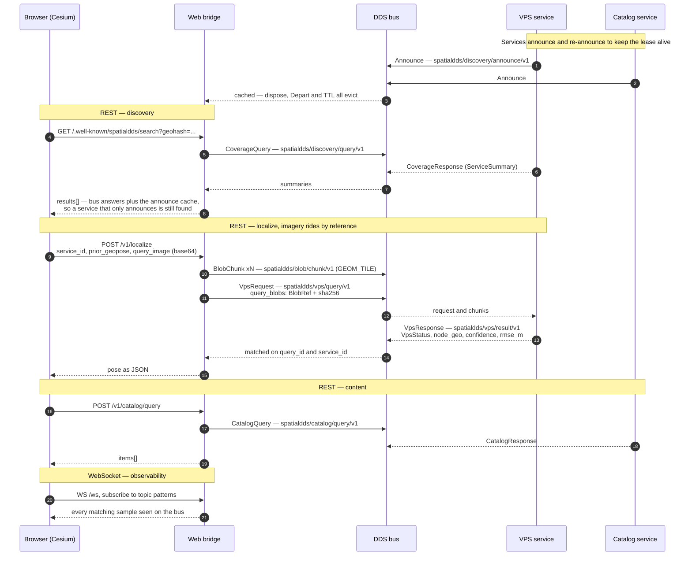
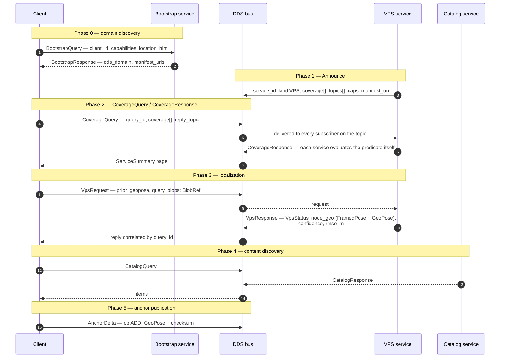

# AR Demo

Bootstrap → discovery → coverage query → localization → catalog → anchor.
The cold-start flow an AR client follows: find a VPS that covers your
area, get a 6DoF localisation, discover content, publish anchors.
Exercised against the canonical IDL bundled at
[`../idl/v1.7`](../idl/v1.7) and the manifests at
[`../manifests/v1.7`](../manifests/v1.7).


## Protocol flow

Two clients reach the same services. The browser goes through the web bridge
over REST and WebSocket; the headless client speaks DDS directly. The bus half
is identical — same topics, same types, same QoS profiles.

### Browser → web bridge → bus

What the Cesium UI actually does. REST is a client convenience, not a second
protocol: every call below turns into typed samples on the well-known topics.



`/health`, `/.well-known/spatialdds/search`, `/v1/localize` and
`/v1/catalog/query` are the whole REST surface the UI uses; `/ws` carries the
DDS message window. Each REST route is a hand-written translation, which is why
the bridge exposes four of them rather than the whole type registry — the
WebSocket needs no such translation and carries anything on the bus.

### Headless client → bus

`run_local_tests_with_logs.sh`. No bridge, no HTTP.



One difference worth knowing: this client names a `BlobRef` for its query
imagery but never publishes the chunks, so the VPS logs the image as not
received and localizes without it. The bridge path does publish them. Nothing
in the exchange depends on the pixels until a real localizer is on the bus —
see [Localize with Image](#localize-with-image).

## Run the protocol flow

The end-to-end flow against a real DDS bus — bootstrap, VPS and catalog
services plus a client, each written to its own log file:

```bash
./run_local_tests_with_logs.sh
```

Builds the `cyclonedds-python` image on first run from the repo
[`Dockerfile`](../Dockerfile). For the full per-service Docker
reference see [`DOCKER_GUIDE.md`](DOCKER_GUIDE.md). Spec-compliance
notes live in [`SPEC_COMPLIANCE.md`](SPEC_COMPLIANCE.md).

## Cesium web UI

A 3D Cesium-Ion visualisation of the AR demo's VPS + catalog services
lives under [`../web/`](../web/). It speaks to the
[web bridge](../bridges/web_bridge/README.md), which fronts the AR
demo's services on `http://localhost:8088`.

```bash
# 1. Configure the Cesium client (from repo root)
cat > web/.env.local <<'EOF'
VITE_CESIUM_ION_TOKEN=<your token>
VITE_CESIUM_ION_ASSET_ID=<your asset id>
VITE_SPATIALDDS_BRIDGE_URL=http://localhost:8088
EOF

# 2. Start the bridge + VPS + catalog stack (Docker)
../run_bridge_server_docker.sh

# 3. Verify the bridge is reachable
curl http://localhost:8088/health

# 4. Start the web UI
cd ../web && npm install && npm run dev
```

Stop the bridge when done with `../stop_bridge_server_docker.sh`.
Logs land under `../bridges/web_bridge/logs/`.

### Localize with Image

**Localize** sends the rendered Cesium view. That exercises the blob lane with
real bytes, but no VPS could match a screenshot against a map. **Localize with
Image** sends the other kind of query: an actual photograph from the scan a VPS
map was built from.

Nothing ships in the repository. Query frames are pictures of a real place and
the manifest carries that place's coordinates, so a bundle is installed locally
into `../web/public/query-frames/`, which is git-ignored. With no bundle present
the button stays disabled and says so.

Install one from any OpenVPS dataset directory — the one holding `status.json`
and `hlocMaps/<map-id>/`:

```bash
../scripts/install_query_frames.py ~/path/to/<dataset-id> --count 3
```

That copies a few of the map's own registered frames and writes
`manifest.json`, whose `anchor` comes from the map's `transform.json`.

Frames from the map, rather than an upload control, because a 1.7 `VpsRequest`
has nowhere to carry camera intrinsics. OpenVPS's DDS binding falls back to the
map's own camera model — right for query images drawn from the map, wrong for a
foreign camera, and their notes record that returning `VPS_SUCCESS` while 9.6 m
out. An upload button would invite exactly that.

The prior is taken from the bundle's anchor rather than the demo's start
position, which is load-bearing rather than cosmetic: discovery is a geohash
search around the prior, so a downtown prior finds no VPS covering a map
scanned elsewhere. Localizing therefore moves the camera to the map.

To exercise it locally the stand-in VPS has to cover that map. Take the
coordinates from the bundle's `manifest.json` and give the stack a bounding box
around them:

```bash
SPATIALDDS_VPS_COVERAGE_BBOX="<lon-min>,<lat-min>,<lon-max>,<lat-max>" \
SPATIALDDS_VPS_MAP_FQN="map/<name>" \
SPATIALDDS_VPS_SERVICE_ID="svc:vps:oarc/openvps-scan" \
  ../run_bridge_server_docker.sh
```

The pose that comes back from the stand-in is **the prior plus a few metres of
jitter** — it reassembles the image and verifies its checksum, then discards it
without looking at a pixel. So sending different frames changes nothing. What
is real is the whole request path: a full-size JPEG chunked onto
`spatialdds/blob/chunk/v1`, reassembled and checksum-verified at the service
that discovery found.

Put a real OpenVPS localizer on the same bus and the identical request returns
a pose computed from the pixels — distinct frames give distinct poses, in
3.6-5.7 s on a T4. That has been run end to end;
[deploy/aws/README.md](../deploy/aws/README.md#running-against-a-real-openvps)
has the recipe. Nothing in this demo changes for it: the button, the request
and the blob lane are the same, and discovery picks whichever VPS covers the
bundle's map.

`web/tests/localize-image.spec.ts` covers the path and skips when no bundle is
installed or no VPS covers it.

## HTTP binding (spec-compliance wrapper, no DDS)

`http_binding.py` is a REST wrapper for the discovery payload shapes —
useful when you just want to exercise the registration/search shapes
without standing up DDS. Distinct from the live web bridge, which
talks to a real DDS bus.

Run from the repository root — it imports `spatialdds_demo`, so the root has
to be on `PYTHONPATH`:

```bash
# Start the REST API (default port 8080)
PYTHONPATH=. python3 ar_demo/http_binding.py

# Register a service manifest
curl -X POST http://localhost:8080/.well-known/spatialdds/register \
  -H "Content-Type: application/json" \
  -d @manifests/v1.7/vps_manifest.json

# Fetch the bootstrap manifest
curl http://localhost:8080/.well-known/spatialdds/bootstrap

# Search by coverage. 1.7 removed CoverageElement.type and CoverageQuery.expr;
# `filter` is the only query form.
curl -X POST http://localhost:8080/.well-known/spatialdds/search \
  -H "Content-Type: application/json" \
  -d '{"coverage":[{"has_crs":true,"crs":"EPSG:4979",
       "has_bbox":true,"bbox":[-122.45,37.75,-122.35,37.85],
       "has_aabb":false,"global":false,"has_frame_ref":false}],
       "coverage_frame_ref":{"uuid":"00000000-0000-0000-0000-000000000000",
       "fqn":"earth-fixed"},"has_filter":true,
       "filter":{"type_in":[],"qos_profile_in":[],"module_id_in":[]}}'
```

The HTTP binding answers with full service manifests —
`{"results": [<manifest>, ...], "next_page_token": ""}`. The on-bus discovery
binding answers the same query with compact `ServiceSummary` rows plus a
`query_id`; see [SPEC_COMPLIANCE.md](SPEC_COMPLIANCE.md) for why the two
bindings differ.
