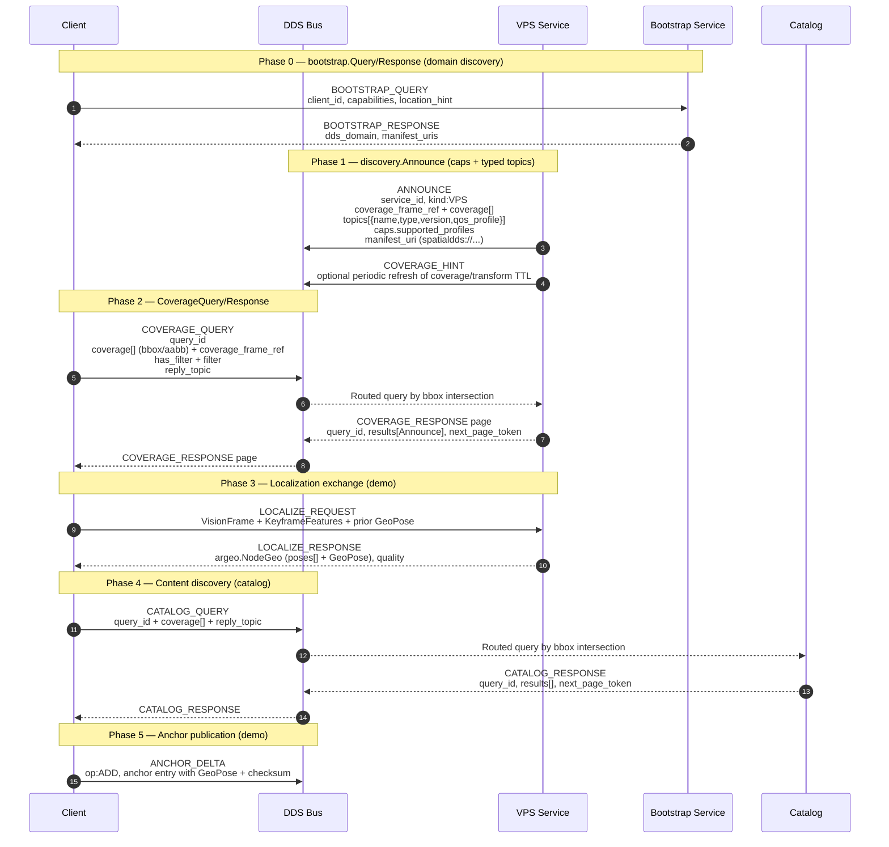

# AR Demo

Bootstrap → discovery → coverage query → localization → catalog → anchor.
The end-to-end SpatialDDS 1.6 protocol flow that an AR client would
follow on cold-start: find a VPS that covers your area, get a 6DoF
localisation back, discover content, publish anchors. Exercised
against the canonical IDL bundled at [`../idl/v1.6`](../idl/v1.6) and
the manifests at [`../manifests/v1.6`](../manifests/v1.6).

A Cesium web UI for this demo lives under [`../web/`](../web/) — see
the root README's "Running the AR demo's Cesium web UI" section for
how to run it together with the
[web bridge](../bridges/web_bridge/README.md).

## Protocol flow



## Quick start (mock + DDS bootstrap with logs)

```bash
./run_local_tests_with_logs.sh
```

The Dockerfile pulls a prebuilt base image with Cyclone DDS + idlc + Python bindings:
`ghcr.io/openarcloud/cyclonedds-python-base:0.10.5-ubuntu22.04`.

To rebuild/publish the base image:
```bash
docker build -f ../Dockerfile.base -t ghcr.io/openarcloud/cyclonedds-python-base:0.10.5-ubuntu22.04 .
docker push ghcr.io/openarcloud/cyclonedds-python-base:0.10.5-ubuntu22.04
```

See [`DOCKER_GUIDE.md`](DOCKER_GUIDE.md) for the full Docker reference.

> The Docker image bakes the AR-demo files at a flat `/app/` layout so
> the example commands below (and inside the container) reference them
> by basename regardless of where they live in the host repo.

## Controlling services separately

The DDS transport uses a single envelope topic
(`spatialdds/envelope/v1`) and requires Cyclone DDS to be enabled
explicitly. The client always starts with bootstrap domain discovery.

Use `--summary-only` for headers only, or omit it for full message details.
If running on the host instead of Docker, install the Cyclone DDS Python
bindings (`cyclonedds==0.10.5`) and ensure `idlc` is on PATH.

### Self-echo filtering

The demo drops DDS envelopes that appear to be sent by the same process
to avoid self-echo on the shared envelope topic. Sender identity is
inferred from payload fields (for example, `from`, `source_id`,
`sender_id`, or `client_frame_ref.fqn`).

### Bootstrap flow

The bootstrap service runs on DDS domain 0 and returns the domain to
use for the actual SpatialDDS demo. Start it first, then run the VPS
and catalog servers on the returned domain (default: 1). The client
queries the bootstrap service and switches domains automatically.

```bash
# Bootstrap server (domain 0, Docker)
docker run --rm --network host \
  -e SPATIALDDS_TRANSPORT=dds \
  -e SPATIALDDS_DDS_DOMAIN=0 \
  -e CYCLONEDDS_URI=file:///etc/cyclonedds.xml \
  cyclonedds-python python3 spatialdds_bootstrap_server.py --domain 1

# VPS server (domain 1, Docker)
docker run --rm --network host \
  -e SPATIALDDS_TRANSPORT=dds \
  -e SPATIALDDS_DDS_DOMAIN=1 \
  -e CYCLONEDDS_URI=file:///etc/cyclonedds.xml \
  cyclonedds-python python3 spatialdds_demo_server.py

# Catalog server (domain 1, Docker)
docker run --rm --network host \
  -e SPATIALDDS_TRANSPORT=dds \
  -e SPATIALDDS_DDS_DOMAIN=1 \
  -e CYCLONEDDS_URI=file:///etc/cyclonedds.xml \
  cyclonedds-python python3 spatialdds_catalog_server.py

# Client (starts on domain 0, switches to domain 1)
docker run --rm --network host \
  -e SPATIALDDS_TRANSPORT=dds \
  -e SPATIALDDS_DDS_DOMAIN=0 \
  -e CYCLONEDDS_URI=file:///etc/cyclonedds.xml \
  cyclonedds-python python3 spatialdds_demo_client.py
```

## HTTP binding (spec-compliance wrapper)

`http_binding.py` is a REST wrapper that mirrors the discovery payload
shapes — handy when you just want to exercise the registration / search
shapes without standing up DDS. Distinct from the live web bridge at
[`../bridges/web_bridge/`](../bridges/web_bridge/README.md), which talks
to a real DDS bus.

```bash
# Start the REST API (default port 8080)
python3 http_binding.py

# Register a service manifest (spatial.manifest@1.6)
curl -X POST http://localhost:8080/.well-known/spatialdds/register \
  -H "Content-Type: application/json" \
  -d @../manifests/v1.6/vps_manifest.json

# Search by coverage
curl -X POST http://localhost:8080/.well-known/spatialdds/search \
  -H "Content-Type: application/json" \
  -d '{
    "coverage": [{"type":"bbox","has_crs":true,"crs":"EPSG:4979","has_bbox":true,"bbox":[-122.45,37.75,-122.35,37.85],"has_aabb":false,"global":false,"has_frame_ref":false}],
    "coverage_frame_ref": {"uuid":"00000000-0000-0000-0000-000000000000","fqn":"earth-fixed"},
    "has_filter": true,
    "filter": { "type_in": [], "qos_profile_in": [], "module_id_in": [] },
    "expr": ""
  }'
```

## Files

| File | Purpose |
|---|---|
| `spatialdds_demo_server.py` | VPS service |
| `spatialdds_demo_client.py` | Demo client (drives the full sequence) |
| `spatialdds_bootstrap_server.py` | Bootstrap (domain discovery) service |
| `spatialdds_catalog_server.py` | Catalog service |
| `spatialdds_demo_tests.py` | Unit tests for the protocol shapes |
| `http_binding.py` | Spec-compliance REST wrapper |
| `comprehensive_test.py` | Default Docker entry point |
| `spatialdds.idl` | Convenience include aggregator for `idlc` |
| `catalog_seed.json` | Sample catalog data |
| `run_all_tests.sh` | Validation + protocol + demo + HTTP-binding tests |
| `run_local_tests_with_logs.sh` | Mock + DDS bootstrap run with logs |
| `DOCKER_GUIDE.md` | Full Docker reference |
| `SPEC_COMPLIANCE.md` | v1.6 compliance notes |
